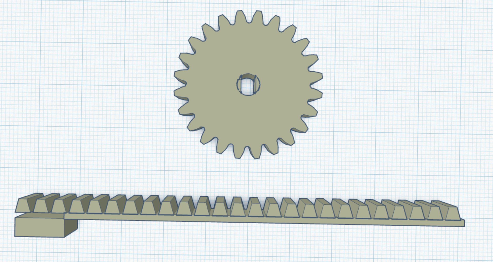
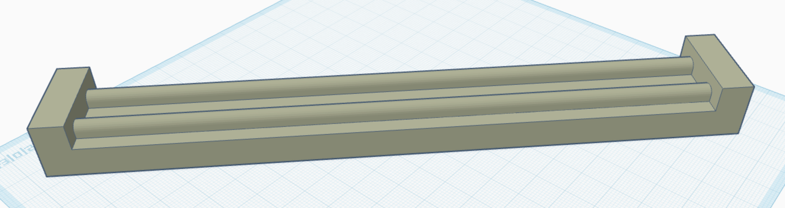
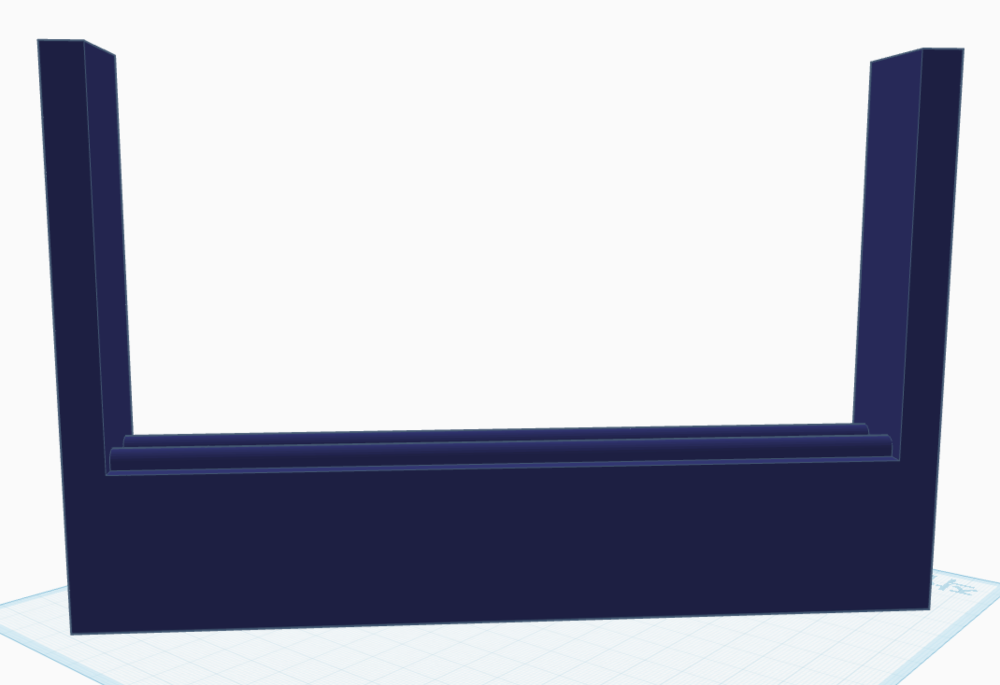
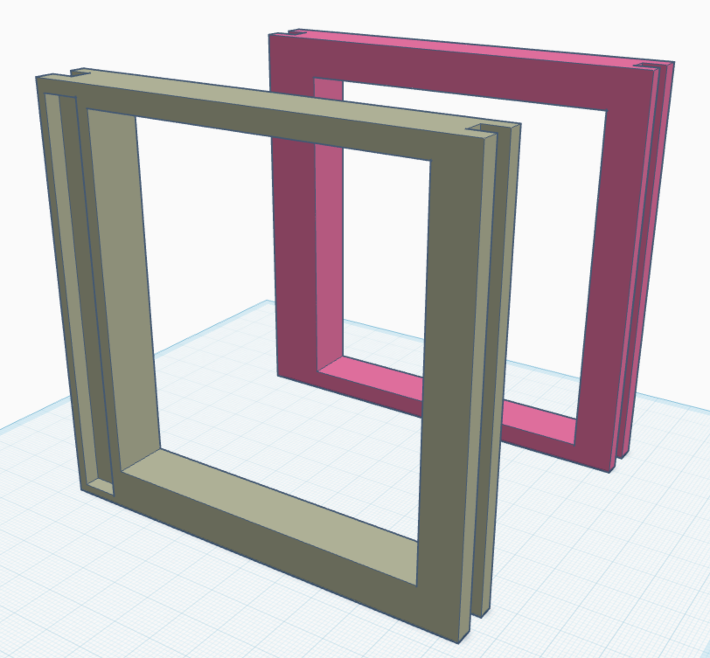

#  🪟 스마트 자동 창문 제어 시스템
이 프로젝트는 스텝모터, 온습도 센서(DHT11), 레인센서, 가스센서, 조도센서, 리미트 스위치 등을 활용하여 환경 조건에 따라 창문을 자동으로 개폐하는 IoT 시스템입니다.
Bluetooth를 통한 수동/자동 전환 및 수동 제어도 지원합니다.

## 🧰 사용 부품
- Arduino Uno
- 스텝모터 + 드라이버
- DHT11 (온습도 센서)
- Rain Sensor (빗물 감지)
- Gas Sensor (가스 감지)
- CDS (조도 센서)
- 리미트 스위치 × 2 (열림/닫힘 감지)
- HC-05 Bluetooth 모듈
- 창문 구조 설계는 3D 프린팅으로 설계하여 하였습니다.
  
## 🖨️ 3D 프린팅 설계 구조

## 💻 소프트웨어
- Arduino IDE
- Bluetooth Serial App (Android)
- GitHub
## 🛠 주요 기능
- 자동 모드: 센서값 기반으로 창문 자동 제어
- 수동 모드: Bluetooth 명령으로 직접 제어
- 창문 열림/닫힘 상태 감지 (리미트 스위치)
- 블루투스를 통한 센서 데이터 실시간 전송
- 예외처리 (센서 오류, 중복 동작 방지 등)

## 💻 주요 코드 흐름

- `loop()`에서 Bluetooth 명령(a/m/o/c) 처리
- 2초마다 센서 값을 읽고 자동 제어 조건 판단
- 조건 충족 시 `openWindow()` 또는 `closeWindow()` 호출
- 스텝모터 제어는 `stepForward()`와 `stepBackward()` 사용
- 창문 상태는 리미트 스위치로 확인하여 무한 동작 방지
## 📸 시연영상

[전체 시연 영상 보기](./214691_강민수_최종프로젝트_IoT컴퓨팅_프로젝트데모영상.mp4)

## 📦 설치 및 실행 방법

1. Arduino IDE에서 `main.ino` 파일 열기
2. 라이브러리 설치
   - `DHT sensor library` by Adafruit
   - `SoftwareSerial` (기본 포함)
3. 보드와 포트 설정 후 업로드
4. Bluetooth Serial 앱에서 HC-05에 연결
   - a: 자동모드 / m: 수동모드 / o: 열기 / c: 닫기

## ✍️ 개발자
- 강민수 (2025, IoT 프로젝트)

## 📄 라이선스
본 프로젝트는 학습 및 비상업적 목적에 한해 자유롭게 사용 가능합니다.